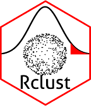

<!-- README.md is generated from README.Rmd. Please edit that file -->

Rclust 
=======================================================================================

Installation
------------

    devtools::install_github("rafaelslins/Rclust")

Usage
-----

    library(Rclust)

References
----------

-   G. von Borries. Partition clustering of High Dimensional Low Sample
    Size data based on P-Values. PhD Thesis, 2008.

-   G. von Borries. A SAS/JMP Integration for Implementation of a
    Clustering Algorithm for High Dimensional Low Sample Size Data. SAS
    Global Forum. Paper 283, 2009.

-   H. Wang and M. G. Akritas. Rank tests for anova with large number of
    factor levels. Journal of Nonparametric Statistics,
    16(3-4):563–589, 2004. URL
    <a href="https://doi.org/10.1080/10485250310001624774" class="uri">https://doi.org/10.1080/10485250310001624774</a>.
